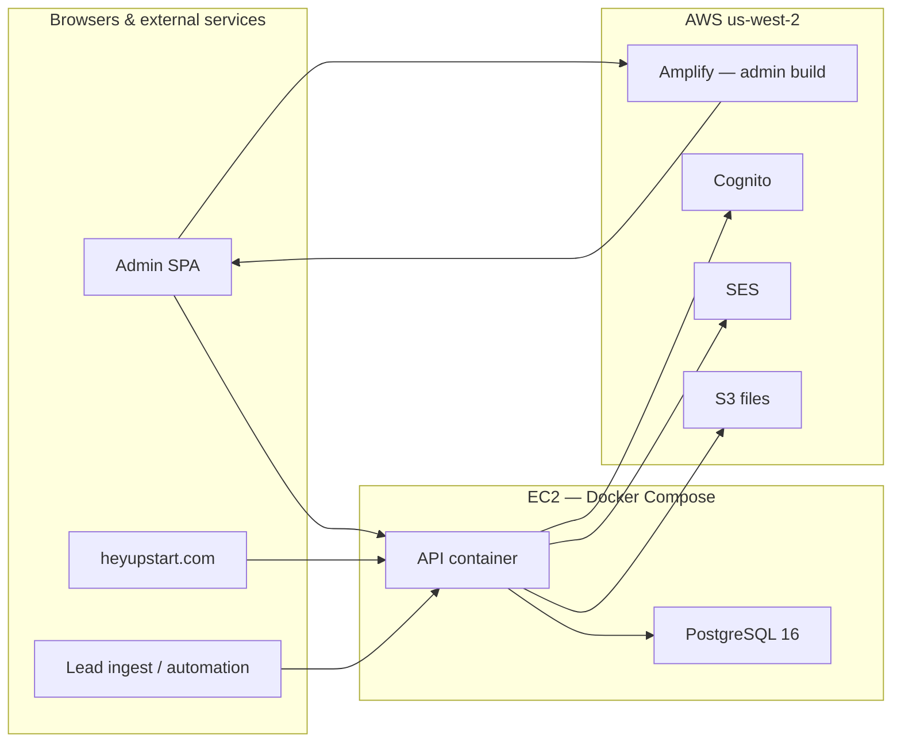

# UpStart Back Office

Internal operations platform for [UpStart Productions](https://heyupstart.com): CRM, project management, time tracking, invoicing, accounting, bookings, and a client portal API. The admin app is an Angular SPA; the API is NestJS with PostgreSQL.

**Production URLs (reference)**

| Surface | URL |
|---------|-----|
| Admin app | https://office.heyupstart.com |
| API | https://api.heyupstart.com/api |
| Marketing site / client portal | https://heyupstart.com |

---

## Features

### Admin app (`admin/`)

| Module | Description | Access |
|--------|-------------|--------|
| **Dashboard** | Configurable widgets: time today, pipeline, invoices, projects | All staff |
| **Clients** | Client records, contact info, portal access, artifacts | All staff |
| **Projects** | Projects per client, tasks, Asana sync, artifacts | All staff |
| **Time tracking** | Start/stop timer, manual entries, hourly rates | All staff |
| **Invoices** | Draft → send → paid workflow, PDF generation, SES email | All staff |
| **Pipeline** | Kanban CRM board; leads by stage; convert to client | All staff |
| **Bookings** | View/cancel appointments; configure booking types | Types: admin |
| **Network** | Partner/vendor directory (companies and contacts) | All staff |
| **Reports** | Time and invoice reports with PDF/Excel export | All staff |
| **Accounting** | Chart of accounts, journal entries, bank CSV import, P&L / balance sheet / trial balance | Admin only |
| **Users** | Staff user management, Cognito invites, avatars | Admin only |
| **Settings** | Asana OAuth, Google Calendar OAuth, service API keys | Admin only |

Shared UI: global search, file/link/note artifacts on clients/projects/leads/network, confirm-before-delete dialogs.

### API (`api/`)

REST API under `/api`. Swagger docs at `/docs` in development.

**Staff modules** (Cognito JWT in production; dev email auth locally): users, clients, projects, time entries, invoices, leads, artifacts, network, search, booking admin, accounting, Asana, Google Calendar, service keys, uploads.

**Public / integration endpoints** (no Cognito — used by heyupstart.com and external services):

| Endpoint prefix | Purpose |
|-----------------|---------|
| `POST /api/portal/session` | Client portal magic-link sessions |
| `GET /api/booking/*` | Public scheduling widget (slots, book, cancel) |
| `POST /api/leads/ingest` | Inbound leads via `x-api-key` (e.g. Donor Readiness Audit) |
| `GET/POST /api/leads/automation/*` | Outreach automation jobs |
| `GET /api/uploads/*` | File proxy (local disk or S3) |

The client portal UI lives on the marketing site, not in this repo. This API provides session tokens and data for `heyupstart.com/clients`.

---

## Architecture



| Layer | Technology |
|-------|------------|
| Monorepo | Nx 22 |
| Admin | Angular 21, PrimeNG 21, PrimeUIX Aura |
| API | NestJS 11, Prisma 7, PostgreSQL 16 |
| Auth (prod) | AWS Cognito + JWT (`aws-amplify` in admin) |
| Auth (dev) | Email-only via `x-user-email` header |
| Email | Amazon SES |
| Files | Local `uploads/` or S3 (`upstart-back-office-files`) |
| PDFs | Puppeteer + Chromium |
| Node | **22.12.0** (see `package.json` engines) |

**AWS region:** All AWS resources use **`us-west-2`**.

---

## Repository layout

```
├── admin/                  # Angular admin SPA (port 4201)
├── api/                    # NestJS API (port 3001 local, 3000 in prod container)
├── apps/api/prisma/        # Prisma schema, migrations, seed
├── libs/shared/            # Shared types and role helpers (@upstart/back-office/shared)
├── scripts/                # Dev env generation, deploy, port cleanup
├── tools/                  # CLI: seed, invites, SES test, storage backfill
├── docs/                   # SES and S3 operational guides
├── email-templates/        # Cognito HTML email templates
├── docker-compose.yml      # Local Postgres only
├── docker-compose.prod.yml # Production API + Postgres on EC2
├── amplify.yml             # Amplify build spec for admin
└── .github/workflows/      # CI: build API image → deploy EC2
```

Nx projects: `admin`, `api`, `shared`. Dependencies are hoisted at the repo root (`package.json`).

---

## Local development

### Prerequisites

- **Node.js 22.12.0** (use `nvm use` or match `engines` in `package.json`)
- **Docker** (for PostgreSQL)
- **npm**

### 1. Clone and configure

```bash
git clone <repo-url> UpStart.BackOffice
cd UpStart.BackOffice
cp .env.example .env
```

Edit `.env` as needed. Defaults work for a minimal local setup (Postgres + dev auth, local file storage).

### 2. Start PostgreSQL

```bash
docker compose up -d
```

Postgres listens on host port **5433** (`ubo` / `ubo` / database `ubo`).

### 3. Install and run

```bash
npm install
npm run dev
```

`npm run dev` will:

1. Generate `admin/src/environments/environment.development.generated.ts` from `.env`
2. Free ports used by prior dev sessions
3. Run `prisma migrate deploy` and `prisma generate`
4. Seed the database if empty (`tools/dev/seed-if-needed.ts`)
5. Start API on **http://localhost:3001** and admin on **http://localhost:4201** (admin waits for API)

Open **http://localhost:4201**.

### Port map

| Service | Port |
|---------|------|
| Admin | 4201 |
| API | 3001 |
| PostgreSQL (Docker) | 5433 |
| Swagger (dev only) | http://localhost:3001/docs |

The admin dev server proxies `/api` to the API (`admin/proxy.conf.json`).

### Dev authentication

**Without Cognito** (default when `COGNITO_USER_POOL_ID` and `COGNITO_CLIENT_ID` are empty):

- Login page accepts any email that exists in the database.
- API authenticates via `DevAuthGuard` using the `x-user-email` header (defaults to `admin@upstart.test`).

**Seed users** (created by `apps/api/prisma/seed.ts`):

| Email | Role |
|-------|------|
| `admin@upstart.test` | ADMIN |
| `jeff@heyupstart.com` | ADMIN |

Seed also creates a sample client (`SMPL`), project, booking type (`upstart-discovery`), and chart of accounts.

**With Cognito locally:** Set `COGNITO_USER_POOL_ID`, `COGNITO_CLIENT_ID`, and related vars in `.env`. Restart `npm run dev` so `set-local-admin-env.js` regenerates the admin environment. Callback URLs must include `http://localhost:4201/` in the Cognito app client.

### Optional: AWS features locally

| Feature | Required env | Doc |
|---------|--------------|-----|
| Invoice email | `AWS_*`, `MAIL_FROM_*` | [docs/ses-setup.md](docs/ses-setup.md) |
| S3 storage | `STORAGE_PROVIDER=s3`, `S3_BUCKET` | [docs/storage-and-s3.md](docs/storage-and-s3.md) |
| Cognito login | `COGNITO_*` | See `.env.example` |
| Client portal links | `PORTAL_BASE_URL`, `PORTAL_SESSION_SECRET` | Default: `http://localhost:4321/clients` |

Without AWS credentials, invoice send shows "Email not configured"; files stay on local disk under `uploads/`.

---

## Environment variables

Templates:

- **Local:** [.env.example](.env.example)
- **Production (EC2):** [.env.production.example](.env.production.example)

| Variable | Purpose |
|----------|---------|
| `DATABASE_URL` | PostgreSQL connection string |
| `PORT` | API port (3001 local, 3000 in prod container) |
| `NODE_ENV` | `development` or `production` |
| `AWS_REGION` | Always `us-west-2` |
| `AWS_ACCESS_KEY_ID` / `AWS_SECRET_ACCESS_KEY` | SES, S3, Cognito SDK (or use `~/.aws/credentials`) |
| `COGNITO_*` | User pool, client, region, domain, redirect URLs |
| `MAIL_FROM_EMAIL` / `MAIL_FROM_NAME` | SES sender (domain must be verified) |
| `STORAGE_PROVIDER` | `local` (dev) or `s3` (prod) |
| `S3_BUCKET` / `S3_PUBLIC_URL` | S3 bucket and optional CDN URL |
| `CORS_ORIGINS` | Comma-separated allowed browser origins |
| `CORS_ALLOW_LOCAL_NETWORK` | Allow LAN IPs in dev (`true` locally) |
| `API_BASE_URL` | Public API URL (emails, Amplify build) |
| `PORTAL_BASE_URL` | Client portal base URL for magic links |
| `PORTAL_SESSION_SECRET` | HMAC secret for portal sessions |
| `PORTAL_COOKIE_DOMAIN` | Cross-subdomain cookie (e.g. `.heyupstart.com`) |

Generated at build time (gitignored):

- `admin/src/environments/environment.development.generated.ts` — `scripts/set-local-admin-env.js`
- `admin/src/environments/environment.production.generated.ts` — `scripts/set-amplify-env.js`

---

## npm scripts

| Script | Description |
|--------|-------------|
| `npm run dev` | Full local stack (migrate, seed-if-needed, API + admin) |
| `npm run dev:api` | API only |
| `npm run dev:admin` | Admin only |
| `npm run dev:migrate` | Create a new Prisma migration |
| `npm run dev:seed` | Run seed |
| `npm run dev:reset` | Migrate + generate + seed |
| `npm run dev:kill-ports` | Free dev ports |
| `npm run add-admin-user` | Add a staff user to the database |
| `npm run invite-user -- <email>` | Cognito invite with temporary password |
| `npm run test-ses -- <email>` | Send a test email via SES |
| `npm run backfill-storage-folders` | Create missing S3/local folder placeholders |

**Database commands** (also usable directly):

```bash
npx prisma migrate deploy    # apply migrations
npx prisma migrate dev       # create migration (dev)
npx prisma generate          # regenerate client
npx prisma db seed           # run seed
```

Schema and migrations: `apps/api/prisma/`.

---

## Production deployment

Infrastructure is split: **admin on Amplify**, **API + Postgres on EC2**. There is no Terraform/CDK in this repo — AWS resources are configured outside it.

### API and database (EC2)

1. Provision an EC2 instance with Docker and Docker Compose.
2. Clone this repo on the server.
3. Copy `.env.production.example` to `.env` and fill in secrets.
4. Ensure the instance can pull from GHCR (`ghcr.io/upstart-productions/ubo-api`).

**Start / update manually:**

```bash
docker compose -f docker-compose.prod.yml pull
docker compose -f docker-compose.prod.yml up -d
```

The API container:

- Exposes port **80 → 3000** on the host
- Runs migrations and idempotent seed on startup (`api/docker-entrypoint.sh`)
- Uses system Chromium for invoice PDFs (`api/Dockerfile`)

Point `api.heyupstart.com` (or your domain) at the EC2 instance.

### Admin (AWS Amplify)

Amplify builds only the `admin` app (`amplify.yml`). Set these in the Amplify Console:

| Variable | Example |
|----------|---------|
| `AMPLIFY_MONOREPO_APP_ROOT` | `admin` |
| `AMPLIFY_DIFF_DEPLOY` | `false` |
| `API_BASE_URL` | `https://api.heyupstart.com/api` |
| `AMPLIFY_REDIRECT_SIGN_IN` | `https://office.heyupstart.com/` |
| `AMPLIFY_REDIRECT_SIGN_OUT` | `https://office.heyupstart.com/` |
| `AMPLIFY_COGNITO_CUSTOM_DOMAIN` | `auth.heyupstart.com` |
| `COGNITO_USER_POOL_ID` | (from Cognito) |
| `COGNITO_CLIENT_ID` | (from Cognito) |
| `COGNITO_REGION` | `us-west-2` |
| `COGNITO_DOMAIN_PREFIX` | (Cognito hosted UI prefix) |

Build: `npm ci` → `scripts/set-amplify-env.js` → `nx build admin --configuration=amplify`. Artifacts: `dist/admin/browser`.

### CI/CD (GitHub Actions)

On push to `main` ([`.github/workflows/deploy.yml`](.github/workflows/deploy.yml)):

1. **Build** — Docker image `ghcr.io/upstart-productions/ubo-api:latest` (+ commit SHA tag)
2. **Deploy** — SSH to EC2, `git pull`, run [`scripts/deploy.sh`](scripts/deploy.sh)

**GitHub secrets required:**

| Secret | Purpose |
|--------|---------|
| `EC2_HOST` | Server hostname |
| `EC2_USER` | SSH user |
| `EC2_SSH_KEY` | Private key |
| `EC2_SSH_PORT` | SSH port (optional, default 22) |
| `EC2_REPO_PATH` | Repo path on server |
| `EC2_GHCR` | PAT to pull private GHCR images |

### AWS services checklist

Configure in **us-west-2**:

| Service | Use |
|---------|-----|
| **Cognito** | Staff authentication; app client callbacks for Amplify URLs |
| **SES** | Invoice and notification email; verify `heyupstart.com` | 
| **S3** | `upstart-back-office-files` — avatars, client/project files, invoice PDFs |
| **Amplify** | Host admin SPA |
| **EC2** | Run `docker-compose.prod.yml` |

See [docs/ses-setup.md](docs/ses-setup.md) and [docs/storage-and-s3.md](docs/storage-and-s3.md) for IAM permissions and bucket layout.

### Cognito email templates

HTML templates in `email-templates/`:

- `cognito-invitation.html`
- `cognito-forgot-password.html`

Upload these in the Cognito console for branded auth emails.

---

## External integrations

### Booking widget

Public endpoints under `/api/booking/` serve the scheduling UI on heyupstart.com:

- `GET /api/booking/:slug/meta` — booking type metadata
- `GET /api/booking/:slug/slots` — available time slots
- `POST /api/booking/:slug` — create booking
- `POST /api/booking/cancel/:token` — cancel by token

Configure booking types in admin (**Bookings → Types**). Link Google Calendar in **Settings** for calendar events.

`CORS_ORIGINS` must include the marketing site origin in production.

### Client portal

1. Enable portal on a client record in admin.
2. API issues magic links at `PORTAL_BASE_URL?token=…`.
3. Marketing site calls `POST /api/portal/session` to establish a session cookie.

Requires `PORTAL_SESSION_SECRET` and (in prod) `PORTAL_COOKIE_DOMAIN=.heyupstart.com`.

### Lead ingest

`POST /api/leads/ingest` with header `x-api-key: <service-key>`. Create keys in **Settings → Service keys**. Used by external forms and Lambdas.

### Asana and Google Calendar

OAuth flows configured in **Settings**. Redirect URIs must match your API base URL (e.g. `https://api.heyupstart.com/api/asana/callback`).

---

## Data model (overview)

PostgreSQL via Prisma (`apps/api/prisma/schema.prisma`). Main entities:

- **User** — staff (ADMIN/MEMBER) or linked CLIENT role
- **Client**, **Project**, **ProjectTask**, **TimeEntry**
- **Invoice**, **InvoiceLineItem**
- **Lead** — pipeline stages, convert to client
- **Artifact** — files, links, rich-text notes
- **NetworkCompany**, **NetworkContact**
- **BookingType**, **Booking**, **BookingAvailabilityRule**
- **Account**, **JournalEntry**, **JournalLine**, **BankTransaction**, **CategorizationRule**
- **ServiceKey**, **AsanaIntegration**, **GoogleCalendarIntegration**

22 migrations in `apps/api/prisma/migrations/`.

---

## Troubleshooting

| Issue | Check |
|-------|-------|
| Admin can't reach API | API running on 3001; proxy in `admin/proxy.conf.json` |
| Login fails (dev) | User exists in DB; run `npm run dev:seed` |
| Login fails (prod) | Cognito app client callbacks; Amplify env vars |
| Migrations fail | Postgres up on 5433; `DATABASE_URL` in `.env` |
| Email not sending | [docs/ses-setup.md](docs/ses-setup.md); `npm run test-ses` |
| CORS errors (prod) | `CORS_ORIGINS` includes admin and marketing origins |
| Deploy pull fails | `EC2_GHCR` secret; disk space (`deploy.sh` prunes images) |

---

## License

MIT — see `package.json`.
